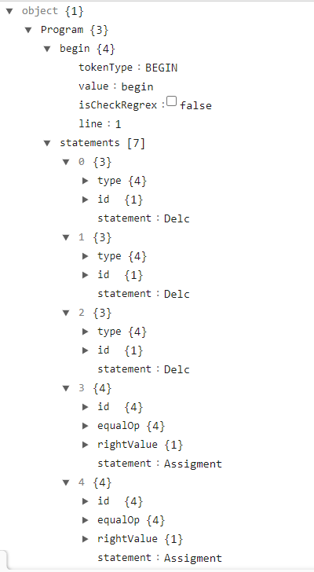
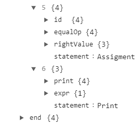

# Tila: A Tiny Language Parser
Author: Do Minh Kha 

Student ID: 21025094
## Overview
The repo contains source code for Tiny Language Parser.

[//]: # (## Table of Contents)

[//]: # ()
[//]: # (* [Overview]&#40;#overview&#41;)

[//]: # (* [Getting Started]&#40;#getting-started&#41;)

[//]: # (    * [Prerequisites]&#40;#prerequisites&#41;)

[//]: # (    * [Get Repo]&#40;#get-repo&#41;)

[//]: # ()
[//]: # (* [Run experiment]&#40;#Run-experiment&#41;)

[//]: # (    * [Prepare Input]&#40;#prepare-input&#41;)

[//]: # (    * [Run]&#40;#run&#41;)

[//]: # (    * [Result]&#40;#View-Result&#41;)

## Getting started
### Prerequisite
Java >= 1.8

## Run experiment
### Prepare Input
Create a .txt file containing the source code of Tiny Language with following grammars:
```
Program	        -> begin Statements end EOF
Statements	-> Statement; Statements
                   | ϵ
Statement	-> Decl
                   | Assigment
                   | Loop
                   | print Expr
Decl 	        -> Type ID ; Decl
                   | ϵ
Type		-> int

Assigment	-> Id = Expr
Exp 		-> Expr - Expr
                   |->Expr * Expr
                   |->Expr ^ Expr
                   |->( Expr )
                   |-> ID
                   |-> NUMBER
Loop		-> while Expr do begin Statements end

ID = [a..z]|[A..Z] ([a..z]|[A..Z]|[0..9])*
NUMBER = 0|[1..9][0..9]*
```
An Example of the input file in this experiment:

```
begin
    int x; int y; int subtract;
    x = 10;
    y = 10;
    subtract=x-y;
    print subtract;
end
```

### Run

[//]: # (* Compile:  ``make compile``)

[//]: # (* Run : ``make run inputFile={The full path of input file}``)

[//]: # (* Clean: ``make clean``)
```java -jar tila.jar <path to input>```
### Result
The result contains syntax tree of the program as
```
{"Program":{"begin":{"tokenType":"BEGIN","value":"begin","isCheckRegrex":false,"line":1},"statements":[{"type":{"tokenType":"INT","value":"int","isCheckRegrex":false,"line":2},"id":{"token":{"tokenType":"ID","value":"x","isCheckRegrex":false,"line":2}},"statement":"Delc"},{"type":{"tokenType":"INT","value":"int","isCheckRegrex":false,"line":2},"id":{"token":{"tokenType":"ID","value":"y","isCheckRegrex":false,"line":2}},"statement":"Delc"},{"type":{"tokenType":"INT","value":"int","isCheckRegrex":false,"line":2},"id":{"token":{"tokenType":"ID","value":"subtract","isCheckRegrex":false,"line":2}},"statement":"Delc"},{"id":{"tokenType":"ID","value":"x","isCheckRegrex":false,"line":3},"equalOp":{"tokenType":"EQUAL","value":"\u003d","isCheckRegrex":false,"line":3},"rightValue":{"value":{"tokenType":"NUMBER","value":"10","isCheckRegrex":false,"line":3}},"statement":"Assigment"},{"id":{"tokenType":"ID","value":"y","isCheckRegrex":false,"line":4},"equalOp":{"tokenType":"EQUAL","value":"\u003d","isCheckRegrex":false,"line":4},"rightValue":{"value":{"tokenType":"NUMBER","value":"10","isCheckRegrex":false,"line":4}},"statement":"Assigment"},{"id":{"tokenType":"ID","value":"subtract","isCheckRegrex":false,"line":5},"equalOp":{"tokenType":"EQUAL","value":"\u003d","isCheckRegrex":false,"line":5},"rightValue":{"left":{"token":{"tokenType":"ID","value":"x","isCheckRegrex":false,"line":5}},"operator":{"tokenType":"SUBTRACT","value":"-","isCheckRegrex":false,"line":5},"right":{"token":{"tokenType":"ID","value":"y","isCheckRegrex":false,"line":5}}},"statement":"Assigment"},{"print":{"tokenType":"PRINT","value":"print","isCheckRegrex":false,"line":6},"expr":{"token":{"tokenType":"ID","value":"subtract","isCheckRegrex":false,"line":6}},"statement":"Print"}],"end":{"tokenType":"END","value":"end","isCheckRegrex":false,"line":7}}}
```
Paste the result to https://jsonformatter.org/json-parser to prettify the result. As
 
### Contributing
This project welcomes contributions and suggestions.
### Contact
@dominhkha
### Acknowledgements

